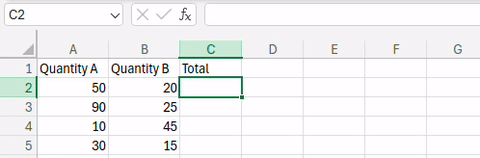
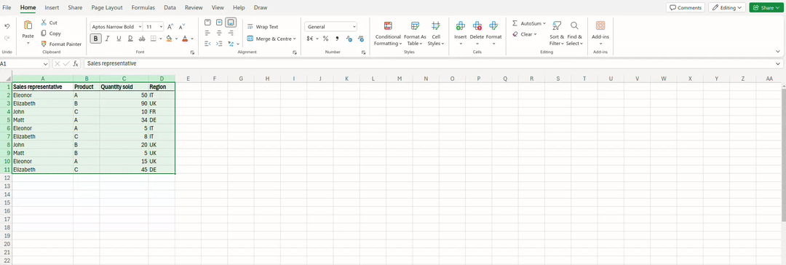

```{r load}
library(tidyverse)
```

## Our goal

#### The data analysis pipeline:

{width=100% fig-align="center"}

## Import

You will learn how to read external data sources from R. In particular, we will focus on

- Universal text formats, as .csv.
- Proprietary spreadsheets formats, as Excel .xls and .xlsx;

## Tidy {style="font-size: 0.8em;"}

You will know how to store your data in a consistent format.

- Each row is an observation;
- Each column a variable, with a unique name.
- Each variable has a specific type (numeric, character, logical, etc..).

```{r tidy}
mpg |> select(manufacturer, displ, model, class, cyl, trans, hwy)
```


## Transform {style="font-size: 0.8em;"}

You will learn how to transform the data at your willingness:

- Select the variables of interest;
- Combine existing variables in new variables;
- Filter relevant observations;
- Reshape data;

```{r transform}
mpg |>
  select(displ, class, hwy)
```

## Visualize {style="font-size: 0.8em;"}

You will learn how to explore data patterns with visualisations.

```{r visualise}
mpg |>
  select(manufacturer, displ, model, class, cyl, trans, hwy) |>
  ggplot(aes(x=displ, y=hwy)) +
  geom_point(aes(col=class), size=2)+
  theme_minimal()+
  labs(y="Fuel efficiency (miles per gallon)", x="Engine size (liters)", col ="Car Type:" )
```

## Model {style="font-size: 0.8em;"}

It's the only step where "math" enters the game. Goes from simple descriptive statistics, to more elaborated modelling strategies.
Often combined with visualisations.

```{r model}
mpg |>
  select(manufacturer, displ, model, class, cyl, trans, hwy) |>
  ggplot(aes(x=displ, y=hwy)) +
  geom_point(aes(col=class), size=2, alpha=0.5)+
  geom_smooth(aes(col=class), method = lm, se=FALSE) +
  theme_minimal()+
  labs(y="Fuel efficiency (miles per gallon)", x="Engine size (liters)", col ="Car Type:" )
```
## Communicate


- Write reports;
- Choose appropriate visualizations;
- Highlight the results in terms of insights.


## Why R?

. . .

::: {.r-fit-text .r-stretch}
Replicability!
:::


## Excel vs R {style="font-size: 0.6em;"}

- Consider creating a new variable in your dataset:

{width=100% fig-align="center"}

. . .

- Now you share your spreadsheet with your colleague.

. . .

- She will not know the formula within each cell unless she inspect all of them individually!

## Excel vs R {style="font-size: 0.6em;"}

```{r}
my_data <- tibble("QuantityA" = c(50, 90, 10, 30),
"QuantityB" = c(20, 25, 45, 15))
```

- Consider the same data in R, stored in the object `my_data`

```{r echo=TRUE}
my_data
```

. . .

- You can create the same `Tot` column you had before in Excel with

```{r echo=TRUE}
my_data |>
  mutate(Tot = QuantityA + QuantityB)
```

. . .

- And now your colleague has no doubt about where those numbers come from!

## Excel VS R {style="font-size: 0.6em;"}

- You are interested in computing the total number of products sold by each representative:

{width=100% fig-align="center"}

. . .

- That's a lot of point-and-clicks!

. . .

- Will your colleague be able to reproduce your results?

## Excel VS R {style="font-size: 0.6em;"}

```{r}
my_data2 <- tibble(
  SalesRepresentative = c("Eleonor", "Elizabeth", "John", "Matt", "Eleonor", "Elizabeth", "John", "Matt", "Eleonor", "Elizabeth"),
  Product = c("A", "B", "C", "A", "A", "C", "B", "B", "A", "C"),
  QuantitySold=c(50, 90, 10, 34, 5, 8, 20, 5, 15, 45),
  Region = c("IT", "UK", "FR", "DE", "IT", "IT", "UK", "UK", "UK", "DE"))
```

Consider the same dataset in R stored in the new object `my_data2`:

```{r echo=TRUE}
my_data2
```


. . .

You get the same results seen in Excel by running

```{r echo=TRUE}
my_data2 |>
  group_by(SalesRepresentative) |>
  summarise(Total = sum(QuantitySold))
```

## RStudio

{width=100% fig-align="center"}

## Basic R grammar {style="font-size: 0.5em;"}
- Run a command:
  - Get the cursor on the line and press CTRL+ENTER on Windows, or CMD+ENTER on MacOS.

- Assign a value to an object

```{r echo = TRUE}
a = 1                            # numeric value assigned with =
b <- 2                           # numeric value assigned with <-
c <- "ciao"                      # character value
c                                # display the content stored in c
```

- Basic math

```{r, echo = TRUE}
a+b                              # sum the values stored in a and b
```

- Create a vector


```{r echo = TRUE}
v1 <- c(1, 7, 2)                 # create the vector manually
v2 <- 1:10                       # create a sequence 1 to 10 automatically
v3 <- seq(1,10,by=2)             # create a sequence automatically with the seq() function
```

- Create and inspect matrices


```{r echo=TRUE}
m <- matrix(1:6, nrow=2, ncol=3) # create a matrix
nrow(m)                          # inspect the number of rows
ncol(m)                          # inspect the number of columns
m[1,2]                           # display element on the first row, at the second column
```


## Missing values {style="font-size: 0.7em;"}

In real datasets, some values are often missing. R represents them as `NA`.

```{r}
#| echo: TRUE
#| eval: TRUE
x <- c(10, 20, NA, 40)
mean(x)
```

. . .

`NA` is contagious: any operation involving `NA` returns `NA`.

To ignore missing values, use the `na.rm` argument:

```{r}
#| echo: TRUE
#| eval: TRUE
mean(x, na.rm = TRUE)
```

. . .

Most summary functions accept `na.rm`: `sum()`, `max()`, `min()`, `sd()`

. . .

To detect missing values:

```{r}
#| echo: TRUE
#| eval: TRUE
is.na(x)
sum(is.na(x))
```

## Seeking help {style="font-size: 0.7em;"}

Use `?` or `help()` to open the documentation of any function:

```{r}
#| echo: TRUE
#| eval: FALSE
?mean
help(mean)
```

. . .

A help page has several sections. Focus on:

- **Arguments**: what inputs the function accepts
- **Examples**: runnable code at the bottom of the page

. . .

Example: "How do I ignore `NA`s in `mean()`?"

1. Run `?mean`
2. Scroll to **Arguments** → find `na.rm`
3. It says: *"a logical value indicating whether NA values should be stripped"*
4. Use `mean(x, na.rm = TRUE)`

## Naming & common mistakes {style="font-size: 0.7em;"}

**Naming conventions:**

- Use `snake_case` for object names: `my_data`, `total_sales`
- R is case-sensitive: `Salary` and `salary` are different objects

. . .

**Common mistakes:**

```{r}
#| echo: TRUE
#| eval: FALSE
mean(c(1, 2, 3)
```
Missing closing `)`. R shows `+` and waits. Press **Esc** to cancel.

. . .

```{r}
#| echo: TRUE
#| eval: FALSE
maen(x)
```
Typo in function name. `Error: could not find function "maen"`

. . .

```{r}
#| echo: TRUE
#| eval: FALSE
My_Vec
```
Wrong case. `Error: object 'My_Vec' not found` (you defined `my_vec`)


## RStudio tips {style="font-size: 0.8em;"}

- **Tab completion**: start typing a function or object name, press `Tab`

- **Insert `<-`**: press `Alt + -` (Windows) or `Option + -` (Mac)

- **Run current line**: `Ctrl+Enter` (Windows) or `Cmd+Enter` (Mac)

- **Environment pane** (top-right): shows all objects you have created

- **Help pane** (bottom-right): displays documentation when you run `?function_name`


## Additional types of objects (i) {style="font-size: 0.8em;"}

Logical values: represent a `TRUE/FALSE`statement

```{r}
#| echo: TRUE
#| eval: TRUE
# store in the object `my_logical` the answer to "is 3 less than 4?".
# Can only take values TRUE/FALSE
my_logical = 3 < 4
my_logical
```

. . .

Factors: categorical variables with known levels

```{r}
#| echo: TRUE
#| eval: TRUE
# start from a raw vector of strings
my_raw_var <- c("low", "low", "medium", "low", "high", "high", "medium")
my_raw_var
```

. . .

```{r}
#| echo: TRUE
#| eval: TRUE
# convert automatically to a factor via `as.factor()`
my_fact <- as.factor(my_raw_var)
my_fact
```

. . .

```{r}
#| echo: TRUE
#| eval: TRUE
# manual construction with `factor()` specifying levels ordering
my_fact <- factor(my_raw_var, levels = c("low", "medium", "high"), ordered=TRUE)
my_fact
```

## Additional types of objects (ii) {style="font-size: 0.8em;"}

**Lists:**

List of objects of potentially different nature

```{r}
#| echo: TRUE
#| eval: TRUE
my_list <- list(          # use the `list()` function
    "A"=c(0,1,2),
    "B"= "ciao",
    "C"= 2<5
)
my_list
```

## Data frames {style="font-size: 0.8em;"}

- Matrices in R constrain all columns to have data of the same type (all numeric, all character, etc...).
- Data frames are more convenient objects where to store your data.

```{r}
#| echo: TRUE
#| eval: TRUE
#| code-line-numbers: "1|2|3|4|5,6,7,8,9|10"
var1 <- c("pop-up", "banner", "video")
var2 <- c(56, 23, 321)
var3 <- c(7,2,25)
var4 <- c(TRUE, FALSE, FALSE)
my_df <- data.frame(
    "ad_type"= var1,
    "n_clicks"=var2,
    "sales"=var3,
    "weekend"=var4)
my_df
```

## Data frames attributes {style="font-size: 0.8em;"}


```{r}
#| echo: TRUE
#| eval: TRUE
colnames(my_df) # get the column names from my_df
```

. . .

```{r}
#| echo: TRUE
#| eval: TRUE
dim(my_df)       # get the dimensions of my_df
```

. . .

```{r}
#| echo: TRUE
#| eval: TRUE
my_df$ad_type    # access a column of my_df by name
```

. . .


```{r}
#| echo: TRUE
#| eval: TRUE
my_df[ , 1]      # access a column by index
```

. . .

```{r}
#| echo: TRUE
#| eval: TRUE
my_df[2 , ]      # acces a row by index
```

## The `txhousing` dataset {style="font-size: 0.7em;"}

R comes with several built-in datasets. Today we will use `txhousing` from the `ggplot2` package: monthly housing market data for 46 Texas cities (2000-2015).

```{r}
#| echo: TRUE
#| eval: TRUE
head(txhousing)
```

. . .

Variables: `city`, `year`, `month`, `sales`, `volume`, `median` (price), `listings`, `inventory`.

## Exploring a dataset {style="font-size: 0.7em;"}

```{r}
#| echo: TRUE
#| eval: TRUE
str(txhousing)
```

. . .

```{r}
#| echo: TRUE
#| eval: TRUE
summary(txhousing$median)
```

Note: `NA's : 616`. There are missing values!

## A first plot: scatterplot {style="font-size: 0.7em;"}

```{r}
#| echo: TRUE
#| eval: TRUE
ggplot(data = txhousing, aes(x = listings, y = sales)) +
  geom_point()
```

## Adding color {style="font-size: 0.7em;"}

```{r}
#| echo: TRUE
#| eval: TRUE
#| code-line-numbers: "2"
ggplot(data = txhousing, aes(x = listings, y = sales)) +
  geom_point(aes(color = city), show.legend = FALSE)
```

46 cities = too many colors! We'll learn how to filter data next class.

## Labeling your plot {style="font-size: 0.7em;"}

```{r}
#| echo: TRUE
#| eval: TRUE
#| code-line-numbers: "3,4,5,6"
ggplot(data = txhousing, aes(x = listings, y = sales)) +
  geom_point() +
  labs(
    title = "Texas housing market",
    x = "Active listings",
    y = "Number of sales"
  )
```

## Choosing the right plot {style="font-size: 0.8em;"}

| Question | Variable types | Geom |
|----------|---------------|------|
| How is the price distributed? | 1 numerical | `geom_histogram()` |
| How many sales per year? | 1 categorical | `geom_bar()` |
| Price vs listings? | 2 numerical | `geom_point()` |
| Price across months? | numerical + categorical | `geom_boxplot()` |

## Visualizing distributions: `geom_histogram()` {style="font-size: 0.7em;"}

```{r}
#| echo: TRUE
#| eval: TRUE
ggplot(data = txhousing, aes(x = median)) +
  geom_histogram(bins = 30) +
  labs(x = "Median house price ($)", y = "Count")
```

Try changing `bins` to 10 or 100. What happens?

## Visualizing categories: `geom_bar()` {style="font-size: 0.7em;"}

```{r}
#| echo: TRUE
#| eval: TRUE
ggplot(data = txhousing, aes(x = year)) +
  geom_bar() +
  labs(x = "Year", y = "Number of monthly records")
```

`geom_bar()` counts for you, you only need to map `x`.

## Comparing groups: `geom_boxplot()` {style="font-size: 0.7em;"}

```{r}
#| echo: TRUE
#| eval: TRUE
ggplot(data = txhousing, aes(x = factor(month), y = median)) +
  geom_boxplot() +
  labs(x = "Month", y = "Median house price ($)")
```

The box = interquartile range (IQR); line inside = median; dots = outliers.

## Multiple panels: `facet_wrap()` {style="font-size: 0.7em;"}

```{r}
#| echo: TRUE
#| eval: TRUE
#| code-line-numbers: "3"
big_cities <- txhousing[txhousing$city %in% c("Houston", "Dallas", "Austin", "San Antonio"), ]
ggplot(data = big_cities, aes(x = listings, y = sales)) +
  geom_point() +
  facet_wrap(~city) +
  labs(x = "Active listings", y = "Number of sales")
```

One panel per group, easier to compare patterns.

## Applying a theme {style="font-size: 0.7em;"}

```{r}
#| echo: TRUE
#| eval: TRUE
#| code-line-numbers: "4"
ggplot(data = txhousing, aes(x = listings, y = sales)) +
  geom_point() +
  labs(title = "Texas housing market", x = "Active listings", y = "Number of sales") +
  theme_minimal()
```

Other options: `theme_bw()`, `theme_classic()`, `theme_light()`

## The ggplot recipe {style="font-size: 0.8em;"}

Every plot follows the same pattern:

```{r}
#| echo: TRUE
#| eval: FALSE
ggplot(data = ___, aes(x = ___, y = ___)) +
  geom_???() +
  labs(title = ___, x = ___, y = ___) +
  theme_minimal()
```

. . .

**You now know 4 geoms:**

| Geom | Use for |
|------|---------|
| `geom_point()` | Scatterplots (2 numerical variables) |
| `geom_histogram()` | Distribution of 1 numerical variable |
| `geom_bar()` | Counts of 1 categorical variable |
| `geom_boxplot()` | Compare a numerical variable across groups |

Next class: data manipulation, importing files, and more plots.

# Hands-on {background="#1565C0"}

## Practice

- Connect to [https://giuseppealfonzetti.github.io/LSM/](https://giuseppealfonzetti.github.io/LSM/)

- Click on the "Material" [(💻)](https://giuseppealfonzetti.github.io/LSM/class1.html) icon corresponding to today lab.
