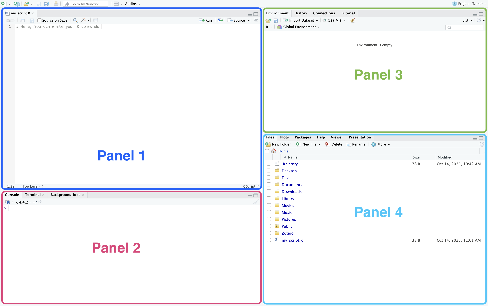

## Rstudio

{width=100% fig-align="center"}

## Recap of R basics {style="font-size: 0.8em;"}

**Basic math:** 

```{r}
#| echo: TRUE
#| eval: FALSE
#| code-line-numbers: "1|2|3|4|5|6|7"
a = 3                            # numeric value assigned with = 
b <- 2                           # numeric value assigne with <- 
a+b                              # sum
a-b                              # difference
a*b                              # multiply
a/b                              # ratio
a^b                              # power
```

. . .

**R Functions:** always called by `name_of_the_function()`

```{r}
#| echo: TRUE
#| eval: TRUE
#| code-line-numbers: "1|2|3"
v1 <- c(1, 7, 2)          # create a vector with the function c()
v2 <- seq(0,10, by=0.5)   # create a vector with the function seq()
m <- matrix(c(0,7,9,2,4,10), nrow=2, ncol=3) # create a matrix by column
```

. . .

**Accessing elements:** Access elements within vector and matrices with `[ ]`.


```{r}
#| echo: TRUE
#| eval: TRUE
v1[2]   # access the second element of v1
m[2,3]  # access the elemnt in the second row - third column cell
```

## Additional types of objects (i) {style="font-size: 0.8em;"}

Logical values: represent a `TRUE/FALSE`statement

```{r}
#| echo: TRUE
#| eval: TRUE
# store in the object `my_logical` the answer to "is 3 less than 4?". 
# Can only take values TRUE/FALSE
my_logical = 3 < 4  
my_logical
```

. . .

Factors: categorical variables with known levels

```{r}
#| echo: TRUE
#| eval: TRUE
# start from a raw vector of strings
my_raw_var <- c("low", "low", "medium", "low", "high", "high", "medium")
my_raw_var
```

. . .

```{r}
#| echo: TRUE
#| eval: TRUE
# convert automatically to a factor via `as.factor()`
my_fact <- as.factor(my_raw_var)
my_fact
```

. . .

```{r}
#| echo: TRUE
#| eval: TRUE
# manual construction with `factor()` specifying levels ordering
my_fact <- factor(my_raw_var, levels = c("low", "medium", "high"), ordered=TRUE)
my_fact
```

## Additional types of objects (ii) {style="font-size: 0.8em;"}

**Lists:**

List of objects of potentially different nature

```{r}
#| echo: TRUE
#| eval: TRUE
my_list <- list(          # use the `list()` function
    "A"=c(0,1,2),
    "B"= "ciao",
    "C"= 2<5
)
my_list
```

## Data frames {style="font-size: 0.8em;"}

- Matrices in R constrain all columns to have data of the same type (all numeric, all character, etc...).
- Data frames are more convenient objects where to store your data.

```{r}
#| echo: TRUE
#| eval: TRUE
#| code-line-numbers: "1|2|3|4|5,6,7,8,9|10"
var1 <- c("pop-up", "banner", "video")
var2 <- c(56, 23, 321)
var3 <- c(7,2,25)
var4 <- c(TRUE, FALSE, FALSE)
my_df <- data.frame(
    "ad_type"= var1, 
    "n_clicks"=var2, 
    "sales"=var3, 
    "weekend"=var4)
my_df
```

## Data frames attributes {style="font-size: 0.8em;"}


```{r}
#| echo: TRUE
#| eval: TRUE
colnames(my_df) # get the column names from my_df
```

. . .

```{r}
#| echo: TRUE
#| eval: TRUE
dim(my_df)       # get the dimensions of my_df
```

. . . 

```{r}
#| echo: TRUE
#| eval: TRUE
my_df$ad_type    # access a column of my_df by name
```

. . .


```{r}
#| echo: TRUE
#| eval: TRUE
my_df[ , 1]      # access a column by index
```

. . . 

```{r}
#| echo: TRUE
#| eval: TRUE
my_df[2 , ]      # acces a row by index
```


## Practice

- Connect to [https://giuseppealfonzetti.github.io/LSM/](https://giuseppealfonzetti.github.io/LSM/)

- Click on the "Material" [(💻)](https://giuseppealfonzetti.github.io/LSM/class1.html) icon corresponding to today lab.

- Download the Excel file.

## Workflow basics

- Create a folder on your laptop where to store all your future analysis;
- Open `Rstudio` and create an `R Project` for today's practice within that folder.
- From your file browser, move the downloaded `.xlsx` file in your project directory in a subdirectory called `data`.
- Within the project, create an `R Script` file. Here you will write your R commands.
- Use the `here` package to manage file paths.

## Setup {style="font-size: 0.7em;"}
- On top of your script file, list the `library()` commands needed to perform the analysis. Today we will use

```{r}
#| echo: TRUE
#| eval: TRUE
#| code-line-numbers: "1|2|3|4"
library(tidyverse)  # data manipulation and plotting
library(here)       # utilities to easily manage directories paths
library(readxl)     # utilities to read Excel files
library(writexl)    # utilities to write Excel files
```

. . .

After loading the R packages, use the `i_am()` function from the `here` package to tell R where your script is located. If your script is called `my_script.R`, run

```{r}
#| echo: TRUE
#| eval: FALSE
i_am("my_script.R")
```

. . .

Now that R knows your position in the directory tree of your laptop, we can read the `xlsx` file stored in the `data` folder with

```{r}
#| echo: TRUE
#| eval: FALSE
#| code-line-numbers: "1|2"
path_to_data <- here("data", "employees.xlsx") # get the exact location of the data
dt <- read_xlsx(path_to_data)                  # read the data
```

. . .

```{r}
#| echo: FALSE
#| eval: TRUE
dt <- read_xlsx("../assets/class2/employees.xlsx")
head(dt, 4)
```

## A first plot


```{r}
#| echo: TRUE
#| eval: TRUE
ggplot(data = dt, aes(x=seniority, y=salary))
```

## A first plot


```{r}
#| echo: TRUE
#| eval: TRUE
#| code-line-numbers: "2"
ggplot(data = dt, aes(x=seniority, y=salary)) +
    geom_point()
```

## A first plot

```{r}
#| echo: TRUE
#| eval: TRUE
#| code-line-numbers: "2"
ggplot(data = dt, aes(x=seniority, y=salary)) +
    geom_point(aes(color=department))
```

# Data manipulation {style="font-size: 0.6em;"}

Visualise all employees in the Marketing department:

```{r}
#| echo: TRUE
#| eval: TRUE
filter(dt, department=="Marketing")
```

. . . 

Sort employees by increasing seniority
```{r}
#| echo: TRUE
#| eval: TRUE
arrange(dt, seniority)
```

# Pipes {style="font-size: 0.7em;"}

Select employees in the Marketing department AND sort them by increasing seniority:

```{r}
#| echo: TRUE
#| eval: TRUE
#| code-line-numbers: "1|2"
filter(dt, department=="Marketing") |> 
    arrange(seniority)
```

# Groupwise manipulations {style="font-size: 0.7em;"}

```{r}
#| echo: TRUE
#| eval: FALSE
#| code-line-numbers: "1|2"
group_by(dt, department) |> 
    summarise(total_salary = sum(salary))
```

. . .

```{r}
#| echo: FALSE
#| eval: TRUE
#| code-line-numbers: "1|2"
group_by(dt, department) |> 
    summarise(total_salary = sum(salary))
```

. . .

```{r}
#| echo: TRUE
#| eval: FALSE
#| code-line-numbers: "3|4|5"
group_by(dt, department) |> 
    summarise(
        total_salary = sum(salary),    # sum of the salary variable by group
        average_salary = mean(salary), # average of the salary variable by group
        n_employees = n()              # number of rows by group
        )
```

. . .

```{r}
#| echo: FALSE
#| eval: TRUE
#| code-line-numbers: "3|4|5"
group_by(dt, department) |> 
    summarise(
        total_salary = sum(salary),    # sum of the salary variable by group
        average_salary = mean(salary), # average of the salary variable by group
        n_employees = n()              # number of rows by group
        )
```

## Export results {style="font-size: 0.7em;"}

Let's say we want to export a summary table of the data and the scatterplot for salary and seniority:

```{r}
#| echo: TRUE
#| eval: FALSE
my_summary <- group_by(dt, department) |> 
                summarise(total_salary = sum(salary))

my_plot <- ggplot(dt, aes(x=seniority, y=salary))+
              geom_point(aes(, col=department)) 
```

. . . 

- Export them as R objects:

```{r}
#| echo: TRUE
#| eval: FALSE
save(my_summary, my_plot, file = here("my_results.rda"))
```

. . .

- Export the table as an Excel file:

```{r}
#| echo: TRUE
#| eval: FALSE
write_xlsx(my_summary, path = here("my_table.xlsx"))
```

. . .

- Export the plot as an image:

```{r}
#| echo: TRUE
#| eval: FALSE
ggsave(my_plot, path = here("my_scatterplot.jpg"))
```