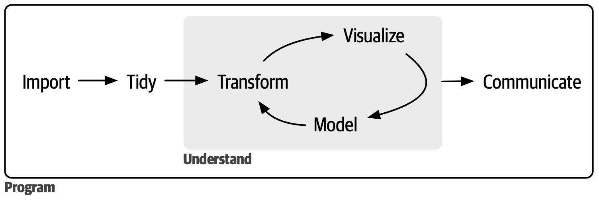

```{r load}
library(tidyverse)
library(readxl)
dt <- read_xlsx("../assets/class2/employees.xlsx")
```

# Why reports from code? {background="#1565C0"}

## The copy-paste workflow {style="font-size: 0.6em;"}

In Lab 2 you computed summaries and plots in an R script. To share them, you would:

1. run the script,
2. copy the numbers into a Word document,
3. export the plots with `ggsave()` and paste them in,
4. write the comments around them.

. . .

Then HR sends you a new version of the data...

. . .

- every number, table and plot must be copied again, by hand;
- sooner or later, a number in the text no longer matches the data.

## The R Markdown workflow {style="font-size: 0.6em;"}

One `.Rmd` file contains **text**, **code** and (after knitting) **results**.

- The numbers in the text are computed by R when the document is created.
- New data? Click **Knit** again: everything updates.
- The analysis is *reproducible*: anyone with the `.Rmd` and the data gets the same report.

. . .

The text is written in **markdown**, a simple syntax for formatted text.

# Markdown basics {background="#1565C0"}

## Headers and emphasis {style="font-size: 0.6em;"}

:::: {.columns}
::: {.column width="50%"}
**You write**

```markdown
# Section

## Subsection

### Sub-subsection

Text in *italic*, in **bold**
and in `code`.
```
:::
::: {.column width="50%"}
**You get**

<span style="font-size:1.6em;font-weight:bold;">Section</span>

<span style="font-size:1.3em;font-weight:bold;">Subsection</span>

<span style="font-size:1.1em;font-weight:bold;">Sub-subsection</span>

Text in *italic*, in **bold**
and in `code`.
:::
::::

. . .

Leave an empty line between paragraphs: a single line break is ignored.

## Lists {style="font-size: 0.6em;"}

:::: {.columns}
::: {.column width="50%"}
**You write**

```markdown
- first item
- second item
    - nested item

1. first step
2. second step
```
:::
::: {.column width="50%"}
**You get**

- first item
- second item
    - nested item

1. first step
2. second step
:::
::::

. . .

Lists need an empty line before them, and nested items must be indented by 4 spaces.

## Links, images and tables {style="font-size: 0.6em;"}

:::: {.columns}
::: {.column width="50%"}
**You write**

```markdown
Visit [R4DS](https://r4ds.hadley.nz/).

{width=40%}

| Dept.   | Employees |
|---------|-----------|
| Finance | 32        |
| HR      | 21        |
```
:::
::: {.column width="50%"}
**You get**

Visit [R4DS](https://r4ds.hadley.nz/).

{width=40%}

| Dept.   | Employees |
|---------|-----------|
| Finance | 32        |
| HR      | 21        |
:::
::::

. . .

Typing tables by hand is fine for small, fixed content. Tables from data are made by R (more on this later).

## Math {style="font-size: 0.6em;"}

:::: {.columns}
::: {.column width="50%"}
**You write**

```markdown
The sample mean is $\bar{x}$.

$$
\bar{x} = \frac{1}{n}\sum_{i=1}^n x_i
$$
```
:::
::: {.column width="50%"}
**You get**

The sample mean is $\bar{x}$.

$$
\bar{x} = \frac{1}{n}\sum_{i=1}^n x_i
$$
:::
::::

. . .

Single `$` for math inside a sentence, double `$$` for a centred equation.

# R Markdown {background="#1565C0"}

## Anatomy of an `.Rmd` file {style="font-size: 0.55em;"}

````markdown
---
title: "Employees report"
author: "Giuseppe Alfonzetti"
output: html_document
---

## Overview

We analyse the salaries of the company employees.

```{{r}}
library(readxl)
dt <- read_xlsx("employees.xlsx")
summary(dt$salary)
```
````

1. **YAML header**, between `---`: title, author, output format.
2. **Text**, written in markdown.
3. **Code chunks**, between ```` ```{r} ```` and ```` ``` ````: R code, run when you knit.

## Knitting {style="font-size: 0.6em;"}

- Create a new file: *File > New File > R Markdown...*
- Click **Knit** (or `Ctrl/Cmd + Shift + K`).
- R runs every chunk from top to bottom, **in a new, clean session**, and writes an `.html` file next to the `.Rmd`.

. . .

Consequences:

- objects in your environment are **not** visible to the report: the `.Rmd` must load packages and read the data itself;
- if a chunk throws an error, knitting stops. Run the chunks one by one (green ▶ button) to debug.

## Paths when knitting {style="font-size: 0.6em;"}

When knitting, the working directory is the folder of the `.Rmd` file. As in Lab 2, use `here()` to build paths from the project root:

```{r}
#| echo: TRUE
#| eval: FALSE
library(here)
i_am("report.Rmd")

dt <- read_xlsx(here("data", "employees.xlsx"))
```

. . .

The report now knits correctly wherever you save it within the project.

## Chunk options {style="font-size: 0.6em;"}

Options go in the chunk header and control what appears in the output:

````markdown
```{{r salary-plot, echo=FALSE, fig.cap="Salary by seniority"}}
ggplot(dt, aes(x = seniority, y = salary)) + geom_point()
```
````

| Option | Effect |
|---|---|
| `echo=FALSE` | hide the code, show the results |
| `eval=FALSE` | show the code, do not run it |
| `include=FALSE` | run the code, show nothing |
| `message=FALSE`, `warning=FALSE` | hide messages and warnings |
| `fig.width`, `fig.height`, `fig.cap` | figure size (inches) and caption |

## The `setup` chunk {style="font-size: 0.6em;"}

Set default options for **all** chunks once, at the top of the document:

````markdown
```{{r setup, include=FALSE}}
knitr::opts_chunk$set(echo = FALSE, message = FALSE, warning = FALSE)

library(tidyverse)
library(here)
library(readxl)

i_am("report.Rmd")
dt <- read_xlsx(here("data", "employees.xlsx"))
```
````

. . .

A single chunk can still override the default, e.g. ```` ```{r, echo=TRUE} ````.

## Inline R code {style="font-size: 0.6em;"}

Put R results directly in a sentence with `` `r ` ``:

:::: {.columns}
::: {.column width="50%"}
**You write**

````markdown
The company employs `r knitr::inline_expr("nrow(dt)")` people,
`r knitr::inline_expr("sum(dt$seniority == 0)")` of them hired this year.
````
:::
::: {.column width="50%"}
**You get**

The company employs `r nrow(dt)` people,
`r sum(dt$seniority == 0)` of them hired this year.
:::
::::

. . .

:::: {.columns}
::: {.column width="50%"}
````markdown
Average salary: `r knitr::inline_expr("round(mean(dt$salary))")`

Average salary: `r knitr::inline_expr('format(round(mean(dt$salary)), big.mark = ",")')`
````
:::
::: {.column width="50%"}
Average salary: `r round(mean(dt$salary))`

Average salary: `r format(round(mean(dt$salary)), big.mark = ",")`
:::
::::

. . .

**Never type a number by hand**: if the data change, inline code updates, typed numbers don't.

## Tables {style="font-size: 0.6em;"}

A data frame printed in a chunk looks like console output. `knitr::kable()` turns it into a proper table:

:::: {.columns}
::: {.column width="50%"}
```{r}
#| echo: TRUE
#| eval: TRUE
report_table <- dt |>
    group_by(department) |>
    summarise(med_sal = median(salary), total_n = n())

report_table
```
:::
::: {.column width="50%"}
```{r}
#| echo: TRUE
#| eval: TRUE
#| classes: small-table
knitr::kable(report_table, digits = 0,
             col.names = c("Department", "Median salary",
                           "Employees"))
```
:::
::::

## Output formats {style="font-size: 0.6em;"}

The `output` field of the YAML header chooses the format:

:::: {.columns}
::: {.column width="50%"}
```yaml
output:
  html_document:
    toc: true
    toc_float: true
    code_folding: hide
```
:::
::: {.column width="50%"}
```yaml
output: word_document
```
:::
::::

- `html_document`: table of contents (`toc`), floating on the side (`toc_float`), code hidden behind a button (`code_folding`).
- `word_document`: a `.docx` you can keep editing in Word.
- `pdf_document` also exists, but it requires LaTeX on your laptop: run `install.packages("tinytex")` and then `tinytex::install_tinytex()`.


. . .

Same `.Rmd`, different outputs: the content does not change.

# Hands-on {background="#1565C0"}

## Practice

- Connect to [https://giuseppealfonzetti.github.io/LSM/](https://giuseppealfonzetti.github.io/LSM/)

- Click on the "Material" [(💻)](https://giuseppealfonzetti.github.io/LSM/class3.html) icon corresponding to today lab.
