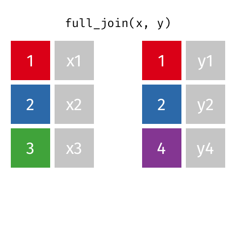
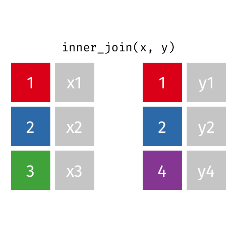
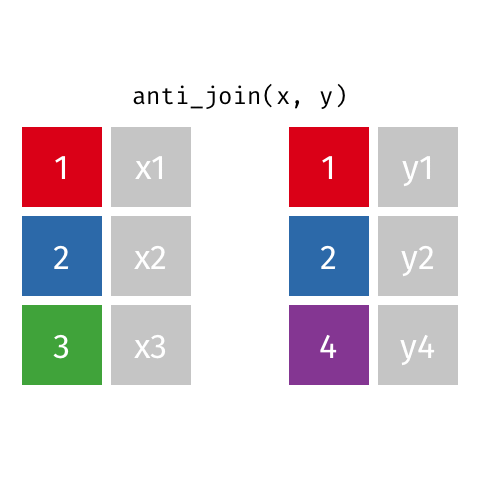

```{r}
library(tidyverse)
```

# Working with multiple data frames
## Case study {style="font-size: 0.6em;"}

```{r}
professions <- read_csv("../assets/class4/professions.csv")
dates <- read_csv("../assets/class4/dates.csv")
works <- read_csv("../assets/class4/works.csv")
```

Data: Information about 10 women in science who changed the world
```{r }
professions |> select(name) 
```


## Information spread across three different datasets {style="font-size: 0.7em;"}
::: {.panel-tabset}

### Professions
```{r}
#| echo: TRUE
professions
```

### Dates
```{r}
#| echo: TRUE
dates
```

### Works
```{r}
#| echo: TRUE
works
```

:::

## Desired output {style="font-size: 0.6em;"}

```{r}
professions |> 
    left_join(dates) |> 
    left_join(works)
```

## Joining data frames {style="font-size: 0.6em;"}

- `left_join()`: all rows from x
- `right_join()`: all rows from y
- `full_join()`: all rows from both x and y
- `semi_join()`: all rows from x where there are matching values in y, keeping just columns from x
- `inner_join()`: all rows from x where there are matching values in y, return 
all combination of multiple matches in the case of multiple matches
- `anti_join()`: return all rows from x where there are not matching values in y, never duplicate rows of x
- ...

## Example {style="font-size: 0.6em;"}

::: {.columns}
::: {.column width="50%"}

```{r}
x <- tibble(
  id = c(1, 2, 3),
  value_x = c("x1", "x2", "x3")
  )
```

```{r}
#| echo=TRUE
x
```
:::
::: {.column width="50%"}

```{r}
y <- tibble(
  id = c(1, 2, 4),
  value_y = c("y1", "y2", "y4")
  )
```

```{r}
#| echo=TRUE
y
```
:::
:::

## `left_join()` {style="font-size: 0.8em;"}

::: {.columns}
::: {.column width="50%"}

:::
::: {.column width="40%"}

```{r}
#| echo=TRUE

x |> 
    left_join(y)
```

```{r}
#| echo=TRUE

x |> 
    left_join(y, by=c("id"="id"))
```


:::
:::

## `right_join()` {style="font-size: 0.8em;"}

::: {.columns}
::: {.column width="50%"}

:::
::: {.column width="40%"}

```{r}
#| echo=TRUE

x |> 
    right_join(y)
```
```{r}
#| echo=TRUE

x |> 
    right_join(y, by=c("id"="id"))
```

:::
:::

## `full_join()` {style="font-size: 0.8em;"}

::: {.columns}
::: {.column width="50%"}

:::
::: {.column width="40%"}

```{r}
#| echo=TRUE

x |> 
    full_join(y)
```
```{r}
#| echo=TRUE

x |> 
    full_join(y, by=c("id"="id"))
```

:::
:::

## `inner_join()` {style="font-size: 0.8em;"}

::: {.columns}
::: {.column width="50%"}

:::
::: {.column width="40%"}

```{r}
#| echo=TRUE

x |> 
    inner_join(y)
```
```{r}
#| echo=TRUE

x |> 
    inner_join(y, by=c("id"="id"))
```

:::
:::

## `semi_join()` {style="font-size: 0.8em;"}

::: {.columns}
::: {.column width="50%"}

:::
::: {.column width="40%"}

```{r}
#| echo=TRUE

x |> 
    semi_join(y)
```
```{r}
#| echo=TRUE

x |> 
    semi_join(y, by=c("id"="id"))
```

:::
:::

## `anti_join()` {style="font-size: 0.8em;"}

::: {.columns}
::: {.column width="50%"}

:::
::: {.column width="40%"}

```{r}
#| echo=TRUE

x |> 
    anti_join(y)
```
```{r}
#| echo=TRUE

x |> 
    anti_join(y, by=c("id"="id"))
```

:::
:::

## Going back to the data {style="font-size: 0.8em;"}

```{r}
#| echo=TRUE

professions |> 
    left_join(dates) |>  # join by name
    left_join(works)     # join by name
```


# Pivoting


```{r}
customers <- read_csv("../assets/class4/customers.csv")
prices <- read_csv("../assets/class4/prices.csv")
```

## Case study {style="font-size: 0.8em;"}


::: {.columns}
::: {.column width="50%"}

```{r}
#| echo=TRUE
customers
```

:::
::: {.column width="40%"}

```{r}
#| echo=TRUE
prices
```
:::
:::

## Desired output {style="font-size: 0.8em;"}


```{r}
customers |> 
  pivot_longer(cols = item_1:item_3, names_to = "item_no", values_to = "item") |> 
  left_join(prices)
```

## From wide to long format {style="font-size: 0.8em;"}

::: {.columns}
::: {.column width="50%"}

```{r}
customers
```

:::
::: {.column width="50%"}

```{r}
customers |> 
  pivot_longer(
    cols = c(item_1, item_2, item_3),  # variables to pivot
    names_to = "item_no",              # column names -> new column called item_no
    values_to = "item"                 # values in columns -> new column called item
    )
```
:::
:::

## `pivot_longer()` {style="font-size: 0.8em;"}
From customers to purchases:


```{r}
#| echo: TRUE
#| eval: TRUE
#| code-line-numbers: "2,6|3|4|5"
purchases <- customers |> 
  pivot_longer(
    cols = c(item_1, item_2, item_3),  # variables to pivot
    names_to = "item_no",              # column names -> new column called item_no
    values_to = "item"                 # values in columns -> new column called item
    )
```

. . . 

```{r}
purchases
```

## `pivot_wider()` {style="font-size: 0.8em;"}
Going back from purchases to customers:

```{r}
#| echo: TRUE
#| eval: TRUE
#| code-line-numbers: "1|2,5|3|4"
purchases |> 
  pivot_wider(
    names_from = "item_no",              # column names 
    values_from = "item"                 # values in columns 
    )
```

## Results {style="font-size: 0.8em;"}

```{r}
#| echo: TRUE
#| eval: TRUE
purchases |> 
  left_join(prices)
```