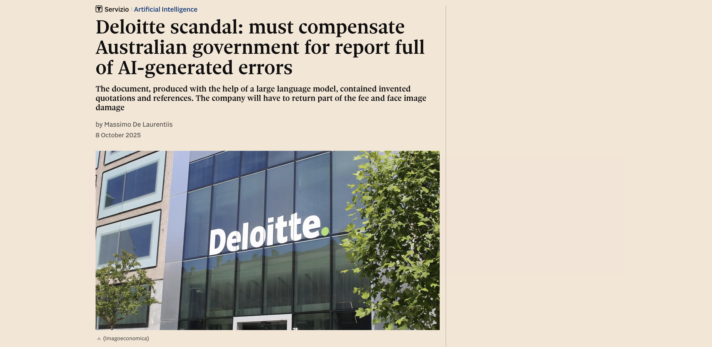
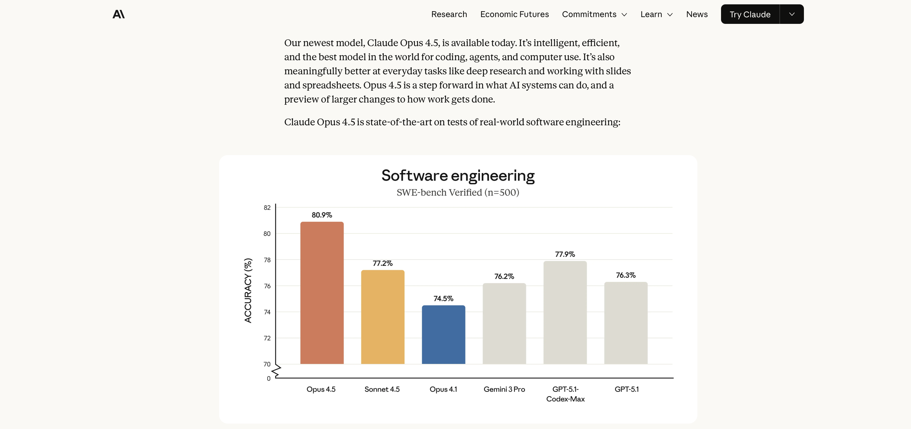
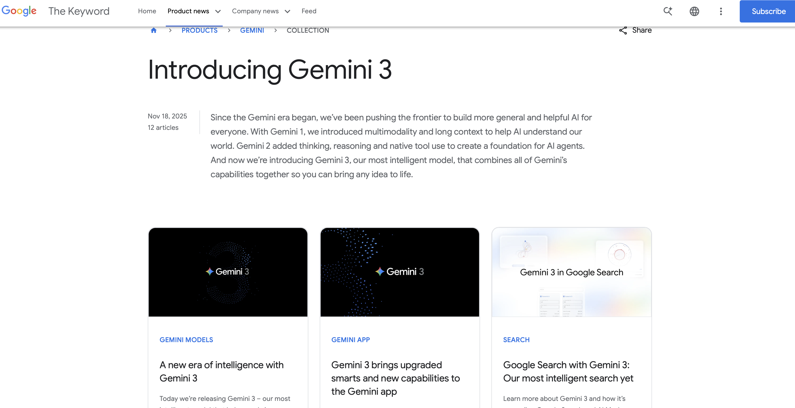
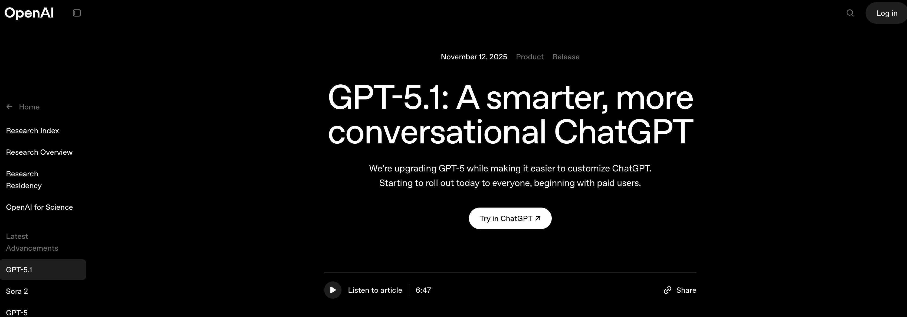

# Data Science and LLMs {style="font-size: 0.7em;"}



# Do not blindly trust LLMs! {style="font-size: 0.7em;"}



# I know you might be tempted... {style="font-size: 0.7em;"}



# I know you might be tempted... {style="font-size: 0.7em;"}



# I know you might be tempted... {style="font-size: 0.7em;"}



# but... {style="font-size: 0.7em;"}


```{r}
#| echo: FALSE
#| eval: TRUE
library(readxl)
library(tidyverse)
mobile_app_data <- read_xlsx("../assets/class5/mobile_app.xlsx")
```


```{r}
#| echo: TRUE
mobile_app_data
```

```{r}
library(downloadthis)
mobile_app_data|> 
    download_this(
    output_name = "mobile_app",
    output_extension = ".xlsx",
    button_label = "Download mobile_app.xlsx",
    button_type = "success",
    has_icon = TRUE,
    icon = "fa fa-save",
    class = "button_small"
  )
```

# but... {style="font-size: 0.7em;"}

::: {.callout-note}
Hi ChatGPT/Claude/Gemini! I need to analyze the attached datasets which collects information about the results of some ad campaigns run within different mobile apps. You need to answer to:

- Which ad type generated more revenue?
- Is there any preference across countries in terms of money spent and game type?
- Which game type costed more in ad investment?
- Use the t-test to answer previous questions when needed.

Furthermore, show me the R code to reproduce the analysis.
:::

- [Claude](https://claude.ai/share/f82311a2-e3db-40b0-b44b-a3a4df54c4df)

- [Gemini](https://gemini.google.com/share/970ce24c3436)

- [ChatGPT](https://chatgpt.com/share/6925e9b9-2564-8006-81d0-9a3b7fe9bb6f)


# Keep the driver's seat! {style="font-size: 0.7em;"}


```{r}
#| echo: TRUE
#| fig-width: 8
#| fig-height: 8
mobile_app_data |> 
  ggplot(aes(x=ad_cost, y=generated_revenue))+
  geom_point(size=5)+
  theme_minimal()
```

